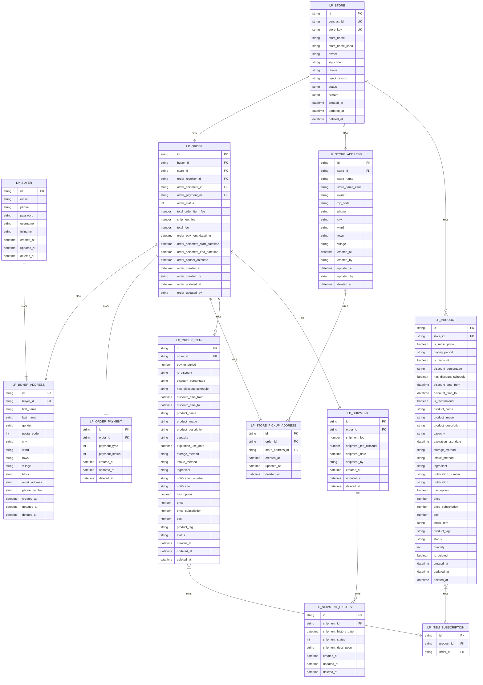
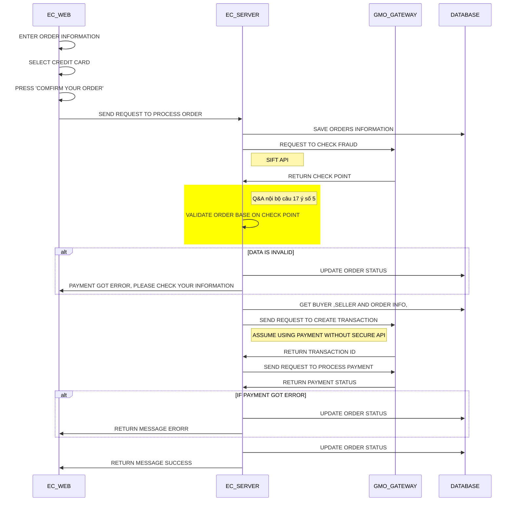
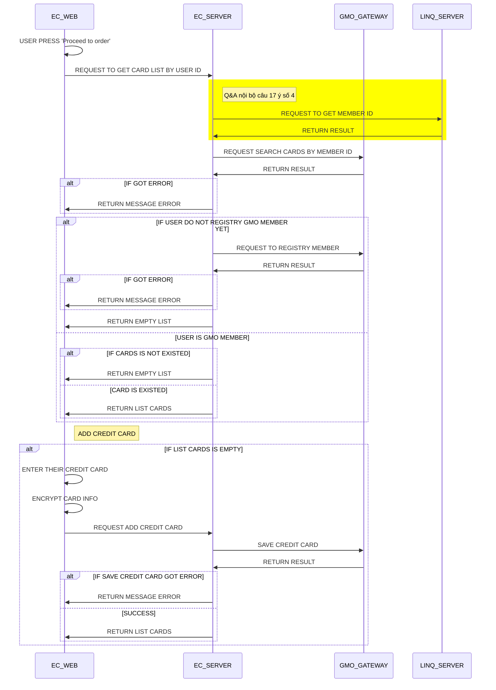
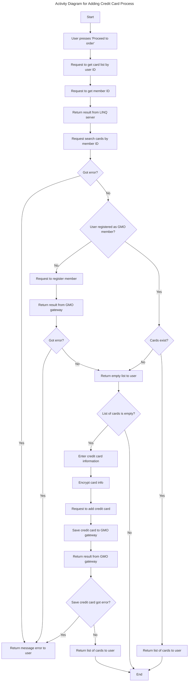

# LINK_PALETTE Payment

## 1. Database degisn

### 1.1 Database relationships

### 1.2 Detail
#### LP_BUYER (Existed)
#### LP_STORE (Existed) 
#### LP_ORDER (Create new)
| id  | column_name                 | data_type  | notes                             |
|-----|-----------------------------|------------|-----------------------------------|
| 1   | id                          | VARCHAR(255) | PRIMARY KEY                      |
| 2   | buyer_id                    | VARCHAR(255) | FOREIGN KEY (LP_BUYER.id)        |
| 3   | store_id                    | VARCHAR(255) | FOREIGN KEY (LP_STORE.id)        |
| 4   | order_receiver_id           | VARCHAR(255) |                                   |
| 5   | order_shipment_id           | VARCHAR(255) |                                   |
| 6   | order_payment_id            | VARCHAR(255) |                                   |
| 7   | order_status                | INT         |            Order Statuses                       |
| 8   | total_order_item_fee        | DECIMAL(10, 2) |                                |
| 9   | shipment_fee                | DECIMAL(10, 2) |                                |
| 10  | total_fee                   | DECIMAL(10, 2) |                                |
| 11  | order_payment_datetime      | DATETIME     |                                |
| 12  | order_shipment_start_datetime | DATETIME     |                             |
| 13  | order_shipment_end_datetime | DATETIME     |                                |
| 14  | order_cancel_datetime       | DATETIME     |                                |
| 15  | order_created_at            | DATETIME     |                                |
| 16  | order_created_by            | VARCHAR(255) |                                |
| 17  | order_updated_at            | DATETIME     |                                |
| 18  | order_updated_by            | VARCHAR(255) |                                |

##### Order Statuses

| Status Code | Status     | Description                    |
|-------------|------------|--------------------------------|
| 0           | Pending    | The order is pending processing|
| 1           | Confirmed  | The order has been confirmed   |
| 2           | Shipped    | The order has been shipped     |
| 3           | Delivered  | The order has been delivered   |
| 4           | Cancelled  | The order has been cancelled   |
| 5           | Returned   | The order has been returned    |


#### LP_ORDER_ITEM (Create new)
| id  | column_name         | data_type  | notes                           |
|-----|---------------------|------------|---------------------------------|
| 1   | id                  | VARCHAR(255) | PRIMARY KEY                    |
| 2   | order_id            | VARCHAR(255) | FOREIGN KEY (LP_ORDER.id)      |
| 3   | buying_period       | INT         |                                 |
| 4   | is_discount         | VARCHAR(10) |                                 |
| 5   | discount_percentage | VARCHAR(10) |                                 |
| 6   | has_discount_schedule | VARCHAR(10) |                               |
| 7   | discount_time_from  | DATETIME    |                                 |
| 8   | discount_time_to    | DATETIME    |                                 |
| 9   | product_name        | VARCHAR(255) |                                |
| 10  | product_image       | TEXT        |                                 |
| 11  | product_description | TEXT        |                                 |
| 12  | capacity            | VARCHAR(50) |                                 |
| 13  | expiration_use_date | DATETIME    |                                 |
| 14  | storage_method      | VARCHAR(255) |                                |
| 15  | intake_method       | VARCHAR(255) |                                |
| 16  | ingredient          | TEXT        |                                 |
| 17  | notification_number | VARCHAR(255) |                                |
| 18  | notification        | TEXT        |                                 |
| 19  | has_option          | BOOLEAN     |                                 |
| 20  | price               | DECIMAL(10, 2) |                                |
| 21  | price_subscription  | DECIMAL(10, 2) |                                |
| 22  | cost                | DECIMAL(10, 2) |                                |
| 23  | product_tag         | VARCHAR(255) |                                |
| 24  | status              | VARCHAR(50)  |                                |
| 25  | created_at          | DATETIME    |                                 |
| 26  | updated_at          | DATETIME    |                                 |
| 27  | deleted_at          | DATETIME    |                                 |

#### LP_ORDER_PAYMENT (Create new)
| id  | column_name    | data_type  | notes                          |
|-----|----------------|------------|--------------------------------|
| 1   | id             | VARCHAR(255) | PRIMARY KEY                   |
| 2   | order_id       | VARCHAR(255) | FOREIGN KEY (LP_ORDER.id)     |
| 3   | payment_type   | INT         |             Payment Types      |
| 4   | payment_status | INT         |          Payment Statuses      |
| 5   | created_at     | DATETIME    |                                |
| 6   | updated_at     | DATETIME    |                                |
| 7   | deleted_at     | DATETIME    |                                |

##### Payment Statuses

| Status Code | Status          | Description                      |
|-------------|-----------------|----------------------------------|
| 0           | Pending         | Payment is pending processing    |
| 1           | Authorized      | Payment has been authorized      |
| 2           | Paid            | Payment has been successfully made |
| 3           | Partially Paid  | Partial payment has been made    |
| 4           | Failed          | Payment attempt has failed       |
| 5           | Refunded        | Payment has been refunded        |
| 6           | Cancelled       | Payment has been cancelled       |

##### Payment Types

| Type Code | Type               | Description                             |
|-----------|--------------------|-----------------------------------------|
| 0         | Credit Card        | Payment made using a credit card         |
| 1         | Debit Card         | Payment made using a debit card          |
| 2         | Bank Transfer      | Payment made via bank transfer           |
| 3         | PayPal             | Payment made via PayPal                 |
| 4         | Cash on Delivery   | Payment made upon delivery of goods      |
| 5         | Mobile Payment     | Payment made via mobile payment service  |
| 6         | Gift Card          | Payment made using a gift card           |


#### LP_STORE_ADDRESS (Create new)
| id  | column_name     | data_type  | notes                           |
|-----|-----------------|------------|---------------------------------|
| 1   | id              | VARCHAR(255) | PRIMARY KEY                    |
| 2   | store_id        | VARCHAR(255) | FOREIGN KEY (LP_STORE.id)      |
| 3   | store_name      | VARCHAR(255) |                                |
| 4   | store_name_kana | VARCHAR(255) |                                |
| 5   | owner           | VARCHAR(255) |                                |
| 6   | zip_code        | VARCHAR(20)  |                                |
| 7   | phone           | VARCHAR(50)  |                                |
| 8   | city            | VARCHAR(255) |                                |
| 9   | ward            | VARCHAR(255) |                                |
| 10  | town            | VARCHAR(255) |                                |
| 11  | village         | VARCHAR(255) |                                |
| 12  | created_at      | DATETIME     |                                |
| 13  | created_by      | VARCHAR(255) |                                |
| 14  | updated_at      | DATETIME     |                                |
| 15  | updated_by      | VARCHAR(255) |                                |
| 16  | deleted_at      | DATETIME     |                                |

#### LP_SHIPMENT (Create new)
| id  | column_name         | data_type  | notes                           |
|-----|---------------------|------------|---------------------------------|
| 1   | id                  | VARCHAR(255) | PRIMARY KEY                    |
| 2   | order_id            | VARCHAR(255) | FOREIGN KEY (LP_ORDER.id)      |
| 3   | shipment_fee        | DECIMAL(10, 2) |                                |
| 4   | shipment_fee_discount | DECIMAL(10, 2) |                             |
| 5   | shipment_date       | DATETIME    |                                 |
| 6   | shipment_by         | VARCHAR(255) |                                |
| 7   | created_at          | DATETIME    |                                 |
| 8   | updated_at          | DATETIME    |                                 |
| 9   | deleted_at          | DATETIME    |                                 |

#### LP_SHIPMENT_HISTORY (Create new)
| id  | column_name           | data_type  | notes                          |
|-----|-----------------------|------------|--------------------------------|
| 1   | id                    | VARCHAR(255) | PRIMARY KEY                   |
| 2   | shipment_id           | VARCHAR(255) | FOREIGN KEY (LP_SHIPMENT.id)  |
| 3   | shipment_history_date | DATETIME    |                                |
| 4   | shipment_status       | INT         |                                |
| 5   | shipment_description  | TEXT        |                                |
| 6   | created_at            | DATETIME    |                                |
| 7   | updated_at            | DATETIME    |                                |
| 8   | deleted_at            | DATETIME    |                                |

#### LP_PRODUCT (Existed) 
| id  | column_name         | data_type  | notes                           |
|-----|---------------------|------------|---------------------------------|
| 1   | id                  | VARCHAR(255) | PRIMARY KEY                    |
| 2   | store_id            | VARCHAR(255) | FOREIGN KEY (LP_STORE.id)      |
| 3   | is_subscription     | BOOLEAN     |                                 |
| 4   | buying_period       | VARCHAR(50) |                                 |
| 5   | is_discount         | BOOLEAN     |                                 |
| 6   | discount_percentage | VARCHAR(10) |                                 |
| 7   | has_discount_schedule | BOOLEAN     |                               |
| 8   | discount_time_from  | DATETIME    |                                 |
| 9   | discount_time_to    | DATETIME    |                                 |
| 10  | is_recommend        | BOOLEAN     |                                 |
| 11  | product_name        | VARCHAR(255) |                                |
| 12  | product_image       | TEXT        |                                 |
| 13  | product_description | TEXT        |                                 |
| 14  | capacity            | VARCHAR(50) |                                 |
| 15  | expiration_use_date | DATETIME    |                                 |
| 16  | storage_method      | VARCHAR(255) |                                |
| 17  | intake_method       | VARCHAR(255) |                                |
| 18  | ingredient          | TEXT        |                                 |
| 19  | notification_number | VARCHAR(255) |                                |
| 20  | notification        | TEXT        |                                 |
| 21  | has_option          | BOOLEAN     |                                 |
| 22  | price               | DECIMAL(10, 2) |                                |
| 23  | price_subscription  | DECIMAL(10, 2) |                                |
| 24  | cost                | DECIMAL(10, 2) |                                |
| 25  | stock_item          | VARCHAR(255) |                                |
| 26  | product_tag         | VARCHAR(255) |                                |
| 27  | status              | VARCHAR(50)  |                                |
| 28  | quantity            | INT         |                                 |
| 29  | is_deleted          | BOOLEAN     |                                 |
| 30  | created_at          | DATETIME    |                                 |
| 31  | updated_at          | DATETIME    |                                 |
| 32  | deleted_at          | DATETIME    |                                 |

#### LP_ITEM_SUBSCRIPTION (Create new) 
| id  | column_name  | data_type  | notes                           |
|-----|--------------|------------|---------------------------------|
| 1   | id           | VARCHAR(255) | PRIMARY KEY                    |
| 2   | product_id   | VARCHAR(255) | FOREIGN KEY (LP_PRODUCT.id)    |
| 3   | order_id     | VARCHAR(255) | FOREIGN KEY (LP_ORDER.id)      |

#### LP_BUYER_ADDRESS (Existed)
| id  | column_name     | data_type  | notes                          |
|-----|-----------------|------------|--------------------------------|
| 1   | id              | VARCHAR(255) | PRIMARY KEY                   |
| 2   | buyer_id        | VARCHAR(255) | FOREIGN KEY (LP_BUYER.id)     |
| 3   | first_name      | VARCHAR(255) |                                |
| 4   | last_name       | VARCHAR(255) |                                |
| 5   | gender          | VARCHAR(10)  |                                |
| 6   | postal_code     | INT          |                                |
| 7   | city            | VARCHAR(255) |                                |
| 8   | ward            | VARCHAR(255) |                                |
| 9   | town            | VARCHAR(255) |                                |
| 10  | village         | VARCHAR(255) |                                |
| 11  | block           | VARCHAR(255) |                                |
| 12  | email_address   | VARCHAR(255) |                                |
| 13  | phone_number    | VARCHAR(50)  |                                |
| 14  | created_at      | DATETIME     |                                |
| 15  | updated_at      | DATETIME     |                                |
| 16  | deleted_at      | DATETIME     |                                |

#### LP_STORE_PICKUP_ADDRESS (Create new)
| id  | column_name      | data_type  | notes                          |
|-----|------------------|------------|--------------------------------|
| 1   | id               | VARCHAR(255) | PRIMARY KEY                   |
| 2   | order_id         | VARCHAR(255) | FOREIGN KEY (LP_ORDER.id)     |
| 3   | store_address_id | VARCHAR(255) | FOREIGN KEY (LP_STORE_ADDRESS.id) |
| 4   | created_at       | DATETIME     |                                |
| 5   | updated_at       | DATETIME     |                                |
| 6   | deleted_at       | DATETIME     |                                |


<!-- ### Database query
```
CREATE TABLE LP_ORDER (
    id VARCHAR(255) PRIMARY KEY,
    buyer_id VARCHAR(255),
    store_id VARCHAR(255),
    order_receiver_id VARCHAR(255),
    order_shipment_id VARCHAR(255),
    order_payment_id VARCHAR(255),
    order_status INT,
    total_order_item_fee DECIMAL(10, 2),
    shipment_fee DECIMAL(10, 2),
    total_fee DECIMAL(10, 2),
    order_payment_datetime DATETIME,
    order_shipment_start_datetime DATETIME,
    order_shipment_end_datetime DATETIME,
    order_cancel_datetime DATETIME,
    order_created_at DATETIME,
    order_created_by VARCHAR(255),
    order_updated_at DATETIME,
    order_updated_by VARCHAR(255),
    FOREIGN KEY (buyer_id) REFERENCES LP_BUYER(id),
    FOREIGN KEY (store_id) REFERENCES LP_STORE(id)
);

CREATE TABLE LP_ORDER_ITEM (
    id VARCHAR(255) PRIMARY KEY,
    order_id VARCHAR(255),
    buying_period INT,
    is_discount VARCHAR(10),
    discount_percentage VARCHAR(10),
    has_discount_schedule VARCHAR(10),
    discount_time_from DATETIME,
    discount_time_to DATETIME,
    product_name VARCHAR(255),
    product_image TEXT,
    product_description TEXT,
    capacity VARCHAR(50),
    expiration_use_date DATETIME,
    storage_method VARCHAR(255),
    intake_method VARCHAR(255),
    ingredient TEXT,
    notification_number VARCHAR(255),
    notification TEXT,
    has_option BOOLEAN,
    price DECIMAL(10, 2),
    price_subscription DECIMAL(10, 2),
    cost DECIMAL(10, 2),
    product_tag VARCHAR(255),
    status VARCHAR(50),
    created_at DATETIME,
    updated_at DATETIME,
    deleted_at DATETIME,
    FOREIGN KEY (order_id) REFERENCES LP_ORDER(id)
);

CREATE TABLE LP_ORDER_PAYMENT (
    id VARCHAR(255) PRIMARY KEY,
    order_id VARCHAR(255),
    payment_type INT,
    payment_status INT,
    created_at DATETIME,
    updated_at DATETIME,
    deleted_at DATETIME,
    FOREIGN KEY (order_id) REFERENCES LP_ORDER(id)
);

CREATE TABLE LP_STORE_ADDRESS (
    id VARCHAR(255) PRIMARY KEY,
    store_id VARCHAR(255),
    store_name VARCHAR(255),
    store_name_kana VARCHAR(255),
    owner VARCHAR(255),
    zip_code VARCHAR(20),
    phone VARCHAR(50),
    city VARCHAR(255),
    ward VARCHAR(255),
    town VARCHAR(255),
    village VARCHAR(255),
    created_at DATETIME,
    created_by VARCHAR(255),
    updated_at DATETIME,
    updated_by VARCHAR(255),
    deleted_at DATETIME,
    FOREIGN KEY (store_id) REFERENCES LP_STORE(id)
);

CREATE TABLE LP_SHIPMENT (
    id VARCHAR(255) PRIMARY KEY,
    order_id VARCHAR(255),
    shipment_fee DECIMAL(10, 2),
    shipment_fee_discount DECIMAL(10, 2),
    shipment_date DATETIME,
    shipment_by VARCHAR(255),
    created_at DATETIME,
    updated_at DATETIME,
    deleted_at DATETIME,
    FOREIGN KEY (order_id) REFERENCES LP_ORDER(id)
);

CREATE TABLE LP_SHIPMENT_HISTORY (
    id VARCHAR(255) PRIMARY KEY,
    shipment_id VARCHAR(255),
    shipment_history_date DATETIME,
    shipment_status INT,
    shipment_description TEXT,
    created_at DATETIME,
    updated_at DATETIME,
    deleted_at DATETIME,
    FOREIGN KEY (shipment_id) REFERENCES LP_SHIPMENT(id)
);

CREATE TABLE LP_PRODUCT (
    id VARCHAR(255) PRIMARY KEY,
    store_id VARCHAR(255),
    is_subscription BOOLEAN,
    buying_period VARCHAR(50),
    is_discount BOOLEAN,
    discount_percentage VARCHAR(10),
    has_discount_schedule BOOLEAN,
    discount_time_from DATETIME,
    discount_time_to DATETIME,
    is_recommend BOOLEAN,
    product_name VARCHAR(255),
    product_image TEXT,
    product_description TEXT,
    capacity VARCHAR(50),
    expiration_use_date DATETIME,
    storage_method VARCHAR(255),
    intake_method VARCHAR(255),
    ingredient TEXT,
    notification_number VARCHAR(255),
    notification TEXT,
    has_option BOOLEAN,
    price DECIMAL(10, 2),
    price_subscription DECIMAL(10, 2),
    cost DECIMAL(10, 2),
    stock_item VARCHAR(255),
    product_tag VARCHAR(255),
    status VARCHAR(50),
    quantity INT,
    is_deleted BOOLEAN,
    created_at DATETIME,
    updated_at DATETIME,
    deleted_at DATETIME,
    FOREIGN KEY (store_id) REFERENCES LP_STORE(id)
);

CREATE TABLE LP_ITEM_SUBSCRIPTION (
    id VARCHAR(255) PRIMARY KEY,
    product_id VARCHAR(255),
    order_id VARCHAR(255),
    FOREIGN KEY (product_id) REFERENCES LP_PRODUCT(id),
    FOREIGN KEY (order_id) REFERENCES LP_ORDER(id)
);

CREATE TABLE LP_BUYER_ADDRESS (
    id VARCHAR(255) PRIMARY KEY,
    buyer_id VARCHAR(255),
    first_name VARCHAR(255),
    last_name VARCHAR(255),
    gender VARCHAR(10),
    postal_code INT,
    city VARCHAR(255),
    ward VARCHAR(255),
    town VARCHAR(255),
    village VARCHAR(255),
    block VARCHAR(255),
    email_address VARCHAR(255),
    phone_number VARCHAR(50),
    created_at DATETIME,
    updated_at DATETIME,
    deleted_at DATETIME,
    FOREIGN KEY (buyer_id) REFERENCES LP_BUYER(id)
);

CREATE TABLE LP_STORE_PICKUP_ADDRESS (
    id VARCHAR(255) PRIMARY KEY,
    order_id VARCHAR(255),
    store_address_id VARCHAR(255),
    created_at DATETIME,
    updated_at DATETIME,
    deleted_at DATETIME,
    FOREIGN KEY (order_id) REFERENCES LP_ORDER(id),
    FOREIGN KEY (store_address_id) REFERENCES LP_STORE_ADDRESS(id)
);

``` -->

## 2. FLOW
### 2.1 PAYMENT FLOW



### 2.2 CREDIT CARD FLOW
[1. ĐĂNG KÍ THÔNG TIN THẺ](https://docs.google.com/presentation/d/1F5zihH70pPHeQn99koyrDkblBSIR3tWA/edit#slide=id.p4)





### API LIST

| Endpoint                  | Method | Description                         |
|---------------------------|--------|-------------------------------------|
| `/buyer_site/orders`             | GET    | Retrieve all orders                 |
| `/buyer_site/orders/:id`         | GET    | Retrieve a specific order           |
| `/buyer_site/orders`             | POST   | Create a new order                  |
| `/buyer_site/orders/:id`         | PUT    | Update a specific order             |
