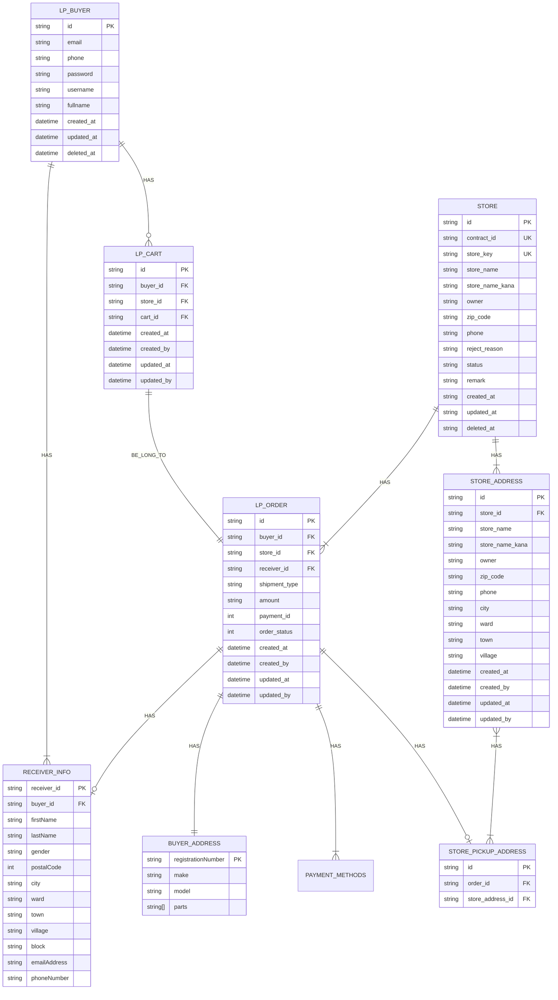

# GMO Payment integration v1.0.0

## Database degisn

### Database relationships

```mermaid
erDiagram

    LP_BUYER{
        string id PK
        string email
        string phone
        string password
        string username
        string fullname
        datetime created_at
        datetime updated_at
        datetime deleted_at
    }

    BUYER_ADDRESS{
        string registrationNumber PK
        string make
        string model
        string[] parts
    }

    LP_CART{
        string id PK
        string buyer_id FK
        string store_id FK
        string cart_id FK
        datetime created_at
        datetime created_by
        datetime updated_at
        datetime updated_by
    }

    STORE{
        string id PK
        string contract_id UK
        string store_key UK
        string store_name
        string store_name_kana
        string owner
        string zip_code
        string phone
        string reject_reason
        string status
        string remark
        string created_at
        string updated_at
        string deleted_at     
    }

    LP_ORDER{
        string id PK
        string buyer_id FK
        string store_id FK
        string receiver_id FK
        string shipment_type 
        string amount
        int payment_id
        int order_status
        datetime created_at
        datetime created_by
        datetime updated_at
        datetime updated_by
    }

    PAYMENT_METHODS{
    }

    STORE_ADDRESS{
        string id PK
        string store_id FK
        string store_name
        string store_name_kana
        string owner
        string zip_code
        string phone
        string city
        string ward
        string town
        string village
        datetime created_at
        datetime created_by
        datetime updated_at
        datetime updated_by
    }

    RECEIVER_INFO{
        string receiver_id PK
        string buyer_id FK
        string firstName
        string lastName
        string gender
        int postalCode
        string city
        string ward
        string town
        string village
        string block
        string emailAddress
        string phoneNumber
    }

   STORE_PICKUP_ADDRESS{
    string id PK
    string order_id FK
    string store_address_id FK
   }

    LP_BUYER ||--|{ RECEIVER_INFO: HAS
    LP_BUYER ||--O{ LP_CART: HAS
    LP_CART ||--|| LP_ORDER: BE_LONG_TO
    LP_ORDER ||--|| BUYER_ADDRESS : HAS
    LP_ORDER ||--|{ PAYMENT_METHODS : HAS
    LP_ORDER ||--o| RECEIVER_INFO : HAS
    LP_ORDER ||--o| STORE_PICKUP_ADDRESS: HAS
    STORE ||--|{ LP_ORDER : HAS
    STORE ||--|{ STORE_ADDRESS: HAS
    STORE_ADDRESS }|--|{STORE_PICKUP_ADDRESS: HAS
    
```